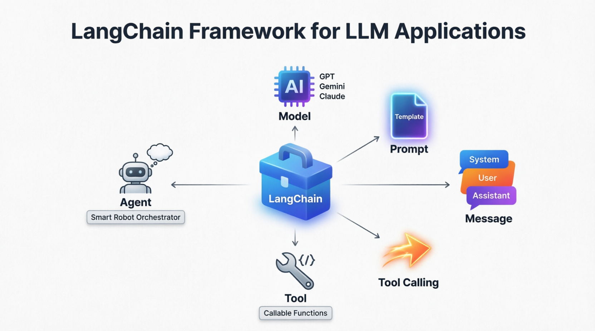
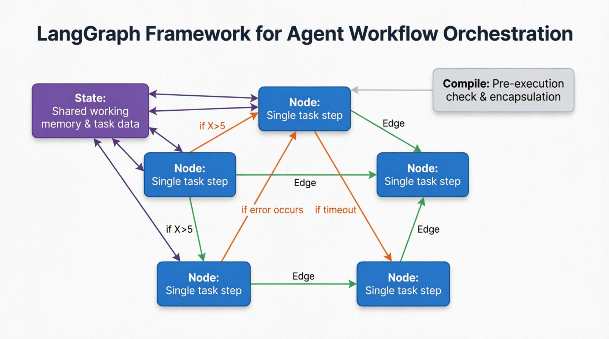
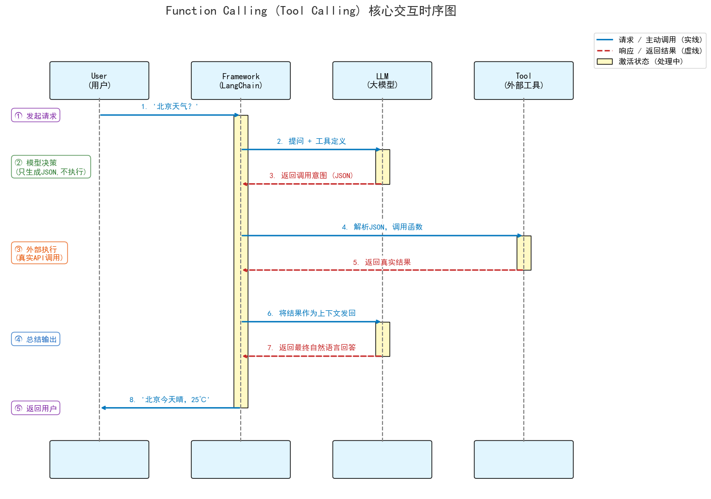

## 1. LangChain & LangGraph 简介

### 1.1. LangChain

LangChain：一个做 LLM 应用的组件工具箱，包括：模型、提示词、工具、消息等工具

Model：大模型本体，例如：GPT、Gemini、Claude

Prompt：给模型的指令模板

Message：LangChain 会统一管理 system、user、assistant 等消息格式

Tool：本质上是可调用函数

Tool Calling：本质上是调用工具

Agent：基于上下文决定要不要调用工具、怎么继续推进任务的执行体



一句话总结：

**Agent** 利用 **LangChain** 工具箱，通过 **Prompt** 和 **Message** 驱动 **Model** ，并在需要时通过 **Tool Calling** 调用外部 **Tool** **，从而完成复杂任务。**

### 1.2. LangGraph

LangGraph：专门做 Agent 流程编排的框架，适合长任务、循环、多步骤执行

State：整个图共享的状态数据，节点可以读写它，可以理解成 Agent的工作记忆和任务面板

Node：图里面的步骤，一个节点通常只干一个事情，例如：调用天气工具、生成报告

Edge：节点之间的连接关系，决定下一步要干啥。例如：if X>5 跳转到节点 A，支持错误处理和超时机制

Conditional Edge：带条件的边

Graph：多个节点&边组成的完整执行流程

Compile：在真正执行前，把图做一次检查和封装，确认结构可执行，会检查节点连接是否合法（是否会陷入死循环）



### 1.3. 差异比较

| **场景**          | **LangChain**       | **LangGraph**                     |
| ----------------- | ------------------- | --------------------------------- |
| **简单任务**      | **✅ 适合**         | **✅ 也可用**                     |
| **长任务/多步骤** | **❌ 难以维护状态** | **✅**`State`全局共享             |
| **条件分支/循环** | **❌ 逻辑易混乱**   | **✅ 可视化条件边 + 循环机制**    |
| **错误处理**      | **❌ 需手动编码**   | **✅ 内置** `if error occurs`路径 |

## 2. ToolCall

Agent 本质都是对模型输入输出的文本进行操作

Function Calling 的本质：大模型本身绝对不执行任何代码！ 它只是通过理解用户意图，生成了一段结构化的“调用请求”（通常是 JSON），然后由外部系统（如你的 Python 代码或 LangChain 框架）去真正执行，最后把结果喂回给大模型。

### 2.1. ToolCall 的理论

**假设用户问：“** _北京今天天气怎么样？_ **”**

#### 2.1.1. 定义工具 (Define Tools)

**在调用大模型前，开发者需要把可用的工具描述清楚（函数名、功能描述、参数结构）。**

```json
{
    "name": "get_weather",
    "description": "获取指定城市的当前天气",
    "parameters": {
        "type": "object",
        "properties": {
            "city": { "type": "string", "description": "城市名称，如北京" }
        },
        "required": ["city"]
    }
}
```

#### 2.1.2.发送请求(Send Request)

用户的提问和工具的描述一起发送给大模型。

**User Message\*\***: "北京今天天气怎么样？"\*\*

**System/Tools** **: [上述 get_weather 的 JSON 描述]**

#### 2.1.3.模型决策与生成意图（Model Reasoning）

大模型分析后发现自己不知道实时天气，但看到工具列表里有 `get_weather`。于是，它 **不直接回答用户** **，而是输出一个** **结构化的函数调用请求** **（拦截输出）。**

```
{
  "tool_calls": [
    {
      "function": {
        "name": "get_weather",
        "arguments": "{\"city\": \"北京\"}"
      }
    }
  ]
}
```

注：此时大模型的工作已经结束，只负责 “意图识别”和“参数提取”

#### 2.1.4.外部系统执行（Framework Execution）

你的应用代码（或 LangChain/LangGraph 框架）拦截到这段 JSON，解析出函数名 get_weather 和参数 北京，然后在本地或服务器上真正执行这个 Python 函数。

```
# 框架在后台默默执行
result = get_weather(city="北京")
# 假设返回结果: "晴，25℃，微风"
```

#### 2.1.5. 结果回传（Return Result）

**框架将函数执行的真实结果，包装成一条 **`ToolMessage`（工具消息），再次发送给大模型。

- Tool Message : "晴，25℃，微风"

#### 2.1.6. 模型总结输出（Final Generation）

大模型接收到天气结果后，结合用户的原始问题，生成最终的自然语言回复。

- Assistant Message : "北京今天的天气是晴天，气温 25℃，伴有微风，非常适合出行。"

#### 2.1.7. 流程总结



#### 2.1.8. 知识补充

为什么大模型能精准输出 JSON 而不是胡乱输出其他的格式？

- 模型是被训练出来的，在 SFT 阶段，模型接触了数百万个“问题 → 工具调用”的配对样本
- 系统提示，调用模型时，框架会对提出的问题重新设计，并给模型一个精心设计后的系统提示，例如：

    ```
    You are an AI assistant that can call functions. When you need to use a function,
    output ONLY in the following JSON format:
    {
      "name": "function_name",
      "arguments": {"param1": "value1", ...}
    }
    DO NOT output anything else. Only output the JSON.
    ```

- 参数提取的 “模式识别”能力，模型可以被训练成从用户问题中自动提取关键参数
- 严格的格式验证机制，首先框架会检查模型输出是否符合预期格式，如果输出的不是有效的 json，框架会重新提示模型，对于一些高级模型在生成时，就知道要返回 json 格式的数据

### 2.2. ToolCall 的代码实现

#### 2.2.1. 基于定义的ToolCall实现

```python
def get_weather(city: str) -> str:
    weather_data = {
        "Beijing": "多云，32度",
        "Chicago": "晴，25度",
        "New York": "雨，28度",
    }
    return f"{city}的天气是：{weather_data.get(city, '未知')}"

def parse_model_output(text: str) -> tuple[str, dict[str, str]]:
    if ":" in text:
        tool, tool_args = text.split(":", 1)
        return tool, tool_args
    return None, {"error": "Invalid format"}

def main() -> None:
    print(f"字符串协议版：")
    model_output = "get_weather: Beijing"
    print(f"假设模型输出: {model_output}")
    tool, tool_args = parse_model_output(model_output)
    print(f"解析结果: {tool}, 参数: {tool_args}")
    if tool == "get_weather":
        result = get_weather(tool_args.strip())
        print(f"工具调用结果: {result}")
    else:
        print("未知工具")

if __name__ == "__main__":
    main()
```

#### 2.2.2. 基于Prompt协议的ToolCall实现

```python
from __future__ import annotations

import json
import os
import re
import sys
from pathlib import Path

from dotenv import load_dotenv
from langchain_core.messages import HumanMessage, SystemMessage
from langchain_openai import ChatOpenAI

DEFAULT_USER_PROMPT = "帮我查一下 Beijing 的天气"

SYSTEM_PROMPT = """
你是一个助手。
系统里有一个工具叫 get_weather，用于查询天气。

当用户询问天气时，不要直接回答。
你必须严格输出下面的格式，不要输出额外内容：

<Tool>get_weather</Tool>
<Args>{"city":"Beijing"}</Args>

如果用户不需要查询天气，就直接输出普通文本。
""".strip()


def get_weather(city: str) -> str:
    weather = {
        "Beijing": "晴天，25 度",
        "Shanghai": "多云，28 度",
        "Hangzhou": "小雨，22 度",
    }
    return f"{city} 的天气是：{weather.get(city, '未知天气')}"


def load_llm() -> ChatOpenAI:
    load_dotenv(Path(__file__).resolve().parents[1] / ".env")
    return ChatOpenAI(
        model=os.getenv("MODEL", "qwen3.5:cloud"),
        base_url=os.getenv("BASE_URL", "http://localhost:11434/v1/"),
        api_key=os.getenv("API_KEY", "ollama"),
        temperature=0,
    )


def parse_tool_call(text: str) -> dict[str, object] | None:
    tool_match = re.search(r"<Tool>(.*?)</Tool>", text, re.DOTALL)
    args_match = re.search(r"<Args>(.*?)</Args>", text, re.DOTALL)

    if not tool_match:
        return None

    args = json.loads(args_match.group(1)) if args_match else {}
    return {
        "tool": tool_match.group(1).strip(),
        "args": args,
    }


def main() -> None:
    user_prompt = " ".join(sys.argv[1:]).strip() or DEFAULT_USER_PROMPT

    print("=== 02. Prompt 协议版 ToolCall ===")
    print("\n用户请求:")
    print(user_prompt)

    response = load_llm().invoke(
        [
            SystemMessage(content=SYSTEM_PROMPT),
            HumanMessage(content=user_prompt),
        ]
    )

    model_text = str(response.content)
    print("\n模型原始输出:")
    print(model_text)

    call = parse_tool_call(model_text)
    if call is None:
        print("\n没有工具调用，模型返回的是普通文本。")
        return

    print("\n解析后的工具请求:")
    print(f"tool_name = {call['tool']}")
    print(f"tool_args = {call['args']}")

    if call["tool"] == "get_weather":
        result = get_weather(**call["args"])
    else:
        result = f"未知工具：{call['tool']}"

    print("\n工具执行结果:")
    print(result)


if __name__ == "__main__":
    main()
```

其中需要理解如下的是：

response = load_llm().invoke(
[
SystemMessage(content=SYSTEM_PROMPT),
HumanMessage(content=user_prompt),
]
)

调用大模型并且进行一次对话请求；传入 SystemMessage，用于告知模型的角色和规则；传入HumanMessage，是用户真正输入的问题；并且返回的 response 并不是普通的字符串，而是一个 “模型回复对象”，真正的文本内容是 response.content，在LangChain中完整的 response 内容如下：

```html
content 模型真正回复的正文 additional_kwargs 模型厂商返回的一些额外字段
response_metadata 模型名、结束原因、token 用量之类的元数据 id
这次消息或调用的标识 usage_metadata 输入输出 token 统计
```

#### 2.2.3. 基于LangChain实现的ToolCall

```python
from __future__ import annotations

import os
import sys
from pathlib import Path

from dotenv import load_dotenv
from langchain_core.messages import HumanMessage, SystemMessage, ToolMessage
from langchain_core.tools import tool
from langchain_openai import ChatOpenAI

DEFAULT_USER_PROMPT = "帮我查一下 Beijing 的天气和时间"

SYSTEM_PROMPT = """
你是一个助手。
如果用户询问天气，请调用 get_weather 工具，不要自己编造天气。
如果用户询问时间，请调用 get_time 工具，不要自己编造时间。
""".strip()


@tool
def get_weather(city: str) -> str:
    """Get the weather for a city."""
    weather = {
        "Beijing": "晴天，25 度",
        "Shanghai": "多云，28 度",
        "Hangzhou": "小雨，22 度",
    }
    return f"{city} 的天气是：{weather.get(city, '未知天气')}"

@tool
def get_time(city: str) -> str:
    """Get the current time for a city."""
    time = {
        "Beijing": "14:00",
        "Shanghai": "14:00",
        "Hangzhou": "14:00",
    }
    return f"{city} 的当前时间是：{time.get(city, '未知时间')}"

def load_llm() -> ChatOpenAI:
    load_dotenv(Path(__file__).resolve().parents[1] / ".env")
    return ChatOpenAI(
        model=os.getenv("MODEL", "qwen3.5:cloud"),
        base_url=os.getenv("BASE_URL", "http://localhost:11434/v1/"),
        api_key=os.getenv("API_KEY", "ollama"),
        temperature=0,
    )


def main() -> None:
    user_prompt = " ".join(sys.argv[1:]).strip() or DEFAULT_USER_PROMPT

    print("=== 03. LangChain 原生 ToolCall ===")
    print("\n用户请求:")
    print(user_prompt)

    tools = [get_weather, get_time]
    llm = load_llm().bind_tools(tools)

    messages = [
        SystemMessage(content=SYSTEM_PROMPT),
        HumanMessage(content=user_prompt),
    ]
    response = llm.invoke(messages)

    print("\n模型文本输出:")
    print(response.content)

    print("\nLangChain 解析出的 tool_calls:")
    print(response.tool_calls)

    for tool_call in response.tool_calls:
        print("\n准备执行工具:")
        print(f"tool_name = {tool_call['name']}")
        print(f"tool_args = {tool_call['args']}")

        if tool_call["name"] == "get_weather":
            result = get_weather.invoke(tool_call["args"])
        elif tool_call["name"] == "get_time":
            result = get_time.invoke(tool_call["args"])
        else:
            result = f"未知工具：{tool_call['name']}"

        print("\n工具执行结果:")
        print(result)

        messages.append(response)
        messages.append(
            ToolMessage(
                content=result,
                name=tool_call["name"],
                tool_call_id=tool_call["id"],
            )
        )

    if response.tool_calls:
        final_response = llm.invoke(messages)
        print("\n把工具结果交回模型后的最终回答:")
        print(final_response.content)


if __name__ == "__main__":
    main()
```

基于 Prompt 构建的ToolCall会导致如果大模型返回的工具名称不完美的话，会导致直接不返回内容，所以使用装饰器 @tool 来绑定工具，并且 LangChain 要求每个工具下面需要用注释来说明该工具的具体实现，以满足大模型可以知道什么时候可以调用该工具
