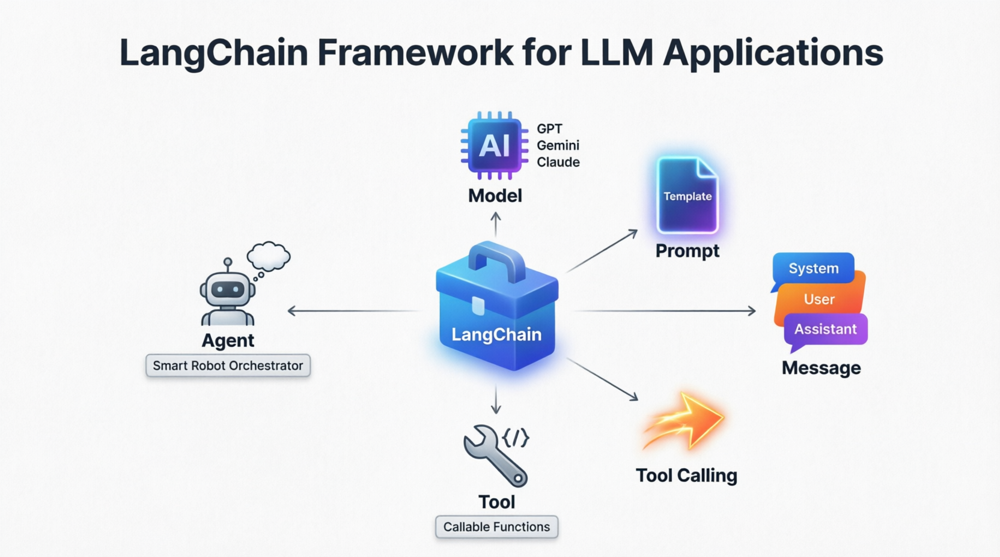
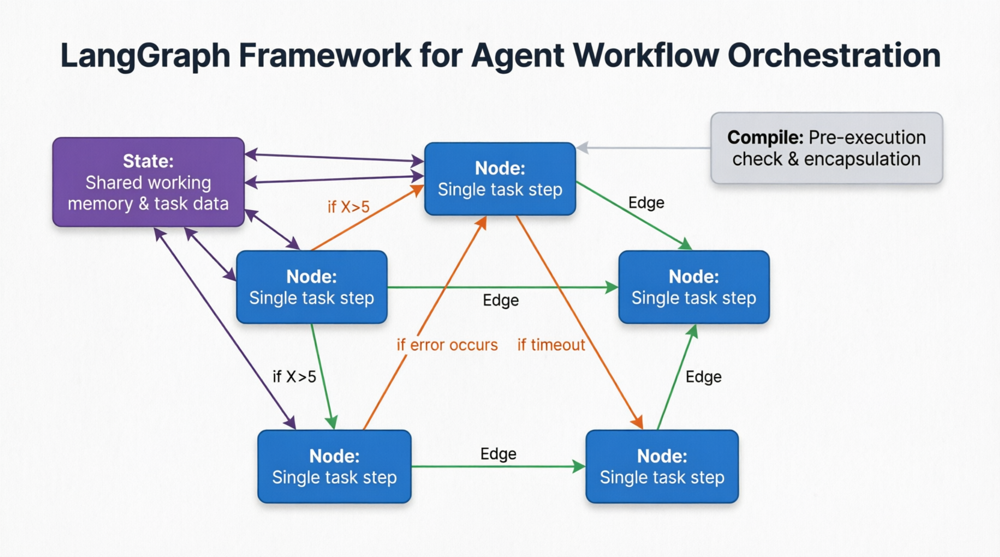
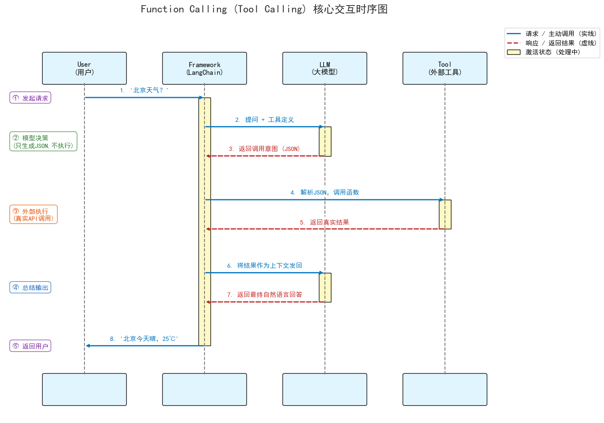
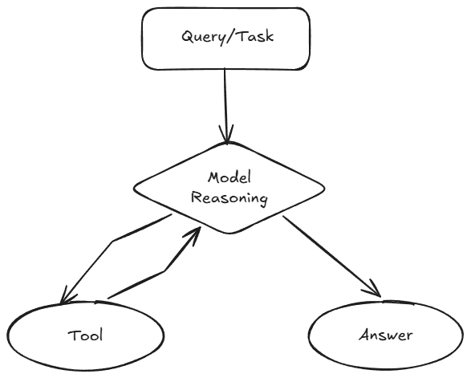
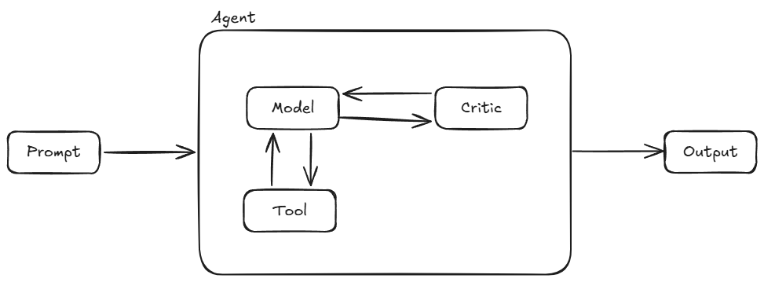
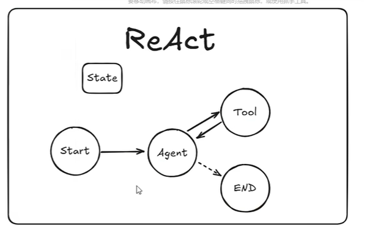
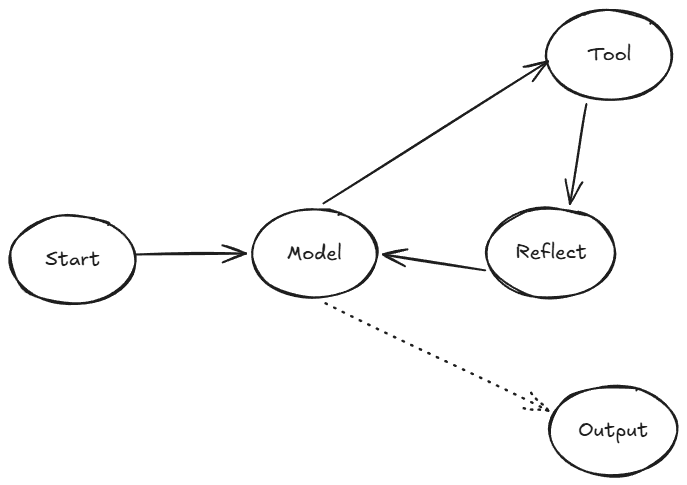

## 1. LangChain & LangGraph 简介

### 1.1. LangChain

LangChain：一个做 LLM 应用的组件工具箱，包括：模型、提示词、工具、消息等工具

Model：大模型本体，例如：GPT、Gemini、Claude

Prompt：给模型的指令模板

Message：LangChain 会统一管理 system、user、assistant 等消息格式

Tool：本质上是可调用函数

Tool Calling：本质上是调用工具

Agent：基于上下文决定要不要调用工具、怎么继续推进任务的执行体



一句话总结：

**Agent** 利用 **LangChain** 工具箱，通过 **Prompt** 和 **Message** 驱动 **Model** ，并在需要时通过 **Tool Calling** 调用外部 **Tool** **，从而完成复杂任务。**

### 1.2. LangGraph

LangGraph：专门做 Agent 流程编排的框架，适合长任务、循环、多步骤执行

State：整个图共享的状态数据，节点可以读写它，可以理解成 Agent的工作记忆和任务面板

Node：图里面的步骤，一个节点通常只干一个事情，例如：调用天气工具、生成报告

Edge：节点之间的连接关系，决定下一步要干啥。例如：if X>5 跳转到节点 A，支持错误处理和超时机制

Conditional Edge：带条件的边

Graph：多个节点&边组成的完整执行流程

Compile：在真正执行前，把图做一次检查和封装，确认结构可执行，会检查节点连接是否合法（是否会陷入死循环）



### 1.3. 差异比较

| **场景**          | **LangChain**       | **LangGraph**                     |
| ----------------- | ------------------- | --------------------------------- |
| **简单任务**      | **✅ 适合**         | **✅ 也可用**                     |
| **长任务/多步骤** | **❌ 难以维护状态** | **✅**`State`全局共享             |
| **条件分支/循环** | **❌ 逻辑易混乱**   | **✅ 可视化条件边 + 循环机制**    |
| **错误处理**      | **❌ 需手动编码**   | **✅ 内置** `if error occurs`路径 |

## 2. ToolCall

Agent 本质都是对模型输入输出的文本进行操作

Function Calling 的本质：大模型本身绝对不执行任何代码！ 它只是通过理解用户意图，生成了一段结构化的“调用请求”（通常是 JSON），然后由外部系统（如你的 Python 代码或 LangChain 框架）去真正执行，最后把结果喂回给大模型。

### 2.1. ToolCall 的理论

**假设用户问：“** _北京今天天气怎么样？_ **”**

#### 2.1.1. 定义工具 (Define Tools)

**在调用大模型前，开发者需要把可用的工具描述清楚（函数名、功能描述、参数结构）。**

```json
{
    "name": "get_weather",
    "description": "获取指定城市的当前天气",
    "parameters": {
        "type": "object",
        "properties": {
            "city": { "type": "string", "description": "城市名称，如北京" }
        },
        "required": ["city"]
    }
}
```

#### 2.1.2.发送请求(Send Request)

用户的提问和工具的描述一起发送给大模型。

**User Message\*\***: "北京今天天气怎么样？"\*\*

**System/Tools** **: [上述 get_weather 的 JSON 描述]**

#### 2.1.3.模型决策与生成意图（Model Reasoning）

大模型分析后发现自己不知道实时天气，但看到工具列表里有 `get_weather`。于是，它 **不直接回答用户** **，而是输出一个** **结构化的函数调用请求** **（拦截输出）。**

```
{
  "tool_calls": [
    {
      "function": {
        "name": "get_weather",
        "arguments": "{\"city\": \"北京\"}"
      }
    }
  ]
}
```

注：此时大模型的工作已经结束，只负责 “意图识别”和“参数提取”

#### 2.1.4.外部系统执行（Framework Execution）

你的应用代码（或 LangChain/LangGraph 框架）拦截到这段 JSON，解析出函数名 get_weather 和参数 北京，然后在本地或服务器上真正执行这个 Python 函数。

```
# 框架在后台默默执行
result = get_weather(city="北京")
# 假设返回结果: "晴，25℃，微风"
```

#### 2.1.5. 结果回传（Return Result）

**框架将函数执行的真实结果，包装成一条 **`ToolMessage`（工具消息），再次发送给大模型。

- Tool Message : "晴，25℃，微风"

#### 2.1.6. 模型总结输出（Final Generation）

大模型接收到天气结果后，结合用户的原始问题，生成最终的自然语言回复。

- Assistant Message : "北京今天的天气是晴天，气温 25℃，伴有微风，非常适合出行。"

#### 2.1.7. 流程总结



#### 2.1.8. 知识补充

为什么大模型能精准输出 JSON 而不是胡乱输出其他的格式？

- 模型是被训练出来的，在 SFT 阶段，模型接触了数百万个“问题 → 工具调用”的配对样本
- 系统提示，调用模型时，框架会对提出的问题重新设计，并给模型一个精心设计后的系统提示，例如：

    ```
    You are an AI assistant that can call functions. When you need to use a function,
    output ONLY in the following JSON format:
    {
      "name": "function_name",
      "arguments": {"param1": "value1", ...}
    }
    DO NOT output anything else. Only output the JSON.
    ```

- 参数提取的 “模式识别”能力，模型可以被训练成从用户问题中自动提取关键参数
- 严格的格式验证机制，首先框架会检查模型输出是否符合预期格式，如果输出的不是有效的 json，框架会重新提示模型，对于一些高级模型在生成时，就知道要返回 json 格式的数据

### 2.2. ToolCall 的代码实现

#### 2.2.1. 基于定义的ToolCall实现

```python
def get_weather(city: str) -> str:
    weather_data = {
        "Beijing": "多云，32度",
        "Chicago": "晴，25度",
        "New York": "雨，28度",
    }
    return f"{city}的天气是：{weather_data.get(city, '未知')}"

def parse_model_output(text: str) -> tuple[str, dict[str, str]]:
    if ":" in text:
        tool, tool_args = text.split(":", 1)
        return tool, tool_args
    return None, {"error": "Invalid format"}

def main() -> None:
    print(f"字符串协议版：")
    model_output = "get_weather: Beijing"
    print(f"假设模型输出: {model_output}")
    tool, tool_args = parse_model_output(model_output)
    print(f"解析结果: {tool}, 参数: {tool_args}")
    if tool == "get_weather":
        result = get_weather(tool_args.strip())
        print(f"工具调用结果: {result}")
    else:
        print("未知工具")

if __name__ == "__main__":
    main()
```

#### 2.2.2. 基于Prompt协议的ToolCall实现

```python
from __future__ import annotations

import json
import os
import re
import sys
from pathlib import Path

from dotenv import load_dotenv
from langchain_core.messages import HumanMessage, SystemMessage
from langchain_openai import ChatOpenAI

DEFAULT_USER_PROMPT = "帮我查一下 Beijing 的天气"

SYSTEM_PROMPT = """
你是一个助手。
系统里有一个工具叫 get_weather，用于查询天气。

当用户询问天气时，不要直接回答。
你必须严格输出下面的格式，不要输出额外内容：

<Tool>get_weather</Tool>
<Args>{"city":"Beijing"}</Args>

如果用户不需要查询天气，就直接输出普通文本。
""".strip()


def get_weather(city: str) -> str:
    weather = {
        "Beijing": "晴天，25 度",
        "Shanghai": "多云，28 度",
        "Hangzhou": "小雨，22 度",
    }
    return f"{city} 的天气是：{weather.get(city, '未知天气')}"


def load_llm() -> ChatOpenAI:
    load_dotenv(Path(__file__).resolve().parents[1] / ".env")
    return ChatOpenAI(
        model=os.getenv("MODEL", "qwen3.5:cloud"),
        base_url=os.getenv("BASE_URL", "http://localhost:11434/v1/"),
        api_key=os.getenv("API_KEY", "ollama"),
        temperature=0,
    )


def parse_tool_call(text: str) -> dict[str, object] | None:
    tool_match = re.search(r"<Tool>(.*?)</Tool>", text, re.DOTALL)
    args_match = re.search(r"<Args>(.*?)</Args>", text, re.DOTALL)

    if not tool_match:
        return None

    args = json.loads(args_match.group(1)) if args_match else {}
    return {
        "tool": tool_match.group(1).strip(),
        "args": args,
    }


def main() -> None:
    user_prompt = " ".join(sys.argv[1:]).strip() or DEFAULT_USER_PROMPT

    print("=== 02. Prompt 协议版 ToolCall ===")
    print("\n用户请求:")
    print(user_prompt)

    response = load_llm().invoke(
        [
            SystemMessage(content=SYSTEM_PROMPT),
            HumanMessage(content=user_prompt),
        ]
    )

    model_text = str(response.content)
    print("\n模型原始输出:")
    print(model_text)

    call = parse_tool_call(model_text)
    if call is None:
        print("\n没有工具调用，模型返回的是普通文本。")
        return

    print("\n解析后的工具请求:")
    print(f"tool_name = {call['tool']}")
    print(f"tool_args = {call['args']}")

    if call["tool"] == "get_weather":
        result = get_weather(**call["args"])
    else:
        result = f"未知工具：{call['tool']}"

    print("\n工具执行结果:")
    print(result)


if __name__ == "__main__":
    main()
```

其中需要理解如下的是：

response = load_llm().invoke(
[
SystemMessage(content=SYSTEM_PROMPT),
HumanMessage(content=user_prompt),
]
)

调用大模型并且进行一次对话请求；传入 SystemMessage，用于告知模型的角色和规则；传入HumanMessage，是用户真正输入的问题；并且返回的 response 并不是普通的字符串，而是一个 “模型回复对象”，真正的文本内容是 response.content，在LangChain中完整的 response 内容如下：

```html
content 模型真正回复的正文 additional_kwargs 模型厂商返回的一些额外字段
response_metadata 模型名、结束原因、token 用量之类的元数据 id
这次消息或调用的标识 usage_metadata 输入输出 token 统计
```

#### 2.2.3. 基于LangChain实现的ToolCall

```python
from __future__ import annotations

import os
import sys
from pathlib import Path

from dotenv import load_dotenv
from langchain_core.messages import HumanMessage, SystemMessage, ToolMessage
from langchain_core.tools import tool
from langchain_openai import ChatOpenAI

DEFAULT_USER_PROMPT = "帮我查一下 Beijing 的天气和时间"

SYSTEM_PROMPT = """
你是一个助手。
如果用户询问天气，请调用 get_weather 工具，不要自己编造天气。
如果用户询问时间，请调用 get_time 工具，不要自己编造时间。
""".strip()


@tool
def get_weather(city: str) -> str:
    """Get the weather for a city."""
    weather = {
        "Beijing": "晴天，25 度",
        "Shanghai": "多云，28 度",
        "Hangzhou": "小雨，22 度",
    }
    return f"{city} 的天气是：{weather.get(city, '未知天气')}"

@tool
def get_time(city: str) -> str:
    """Get the current time for a city."""
    time = {
        "Beijing": "14:00",
        "Shanghai": "14:00",
        "Hangzhou": "14:00",
    }
    return f"{city} 的当前时间是：{time.get(city, '未知时间')}"

def load_llm() -> ChatOpenAI:
    load_dotenv(Path(__file__).resolve().parents[1] / ".env")
    return ChatOpenAI(
        model=os.getenv("MODEL", "qwen3.5:cloud"),
        base_url=os.getenv("BASE_URL", "http://localhost:11434/v1/"),
        api_key=os.getenv("API_KEY", "ollama"),
        temperature=0,
    )


def main() -> None:
    user_prompt = " ".join(sys.argv[1:]).strip() or DEFAULT_USER_PROMPT

    print("=== 03. LangChain 原生 ToolCall ===")
    print("\n用户请求:")
    print(user_prompt)

    tools = [get_weather, get_time]
    llm = load_llm().bind_tools(tools)

    messages = [
        SystemMessage(content=SYSTEM_PROMPT),
        HumanMessage(content=user_prompt),
    ]
    response = llm.invoke(messages)

    print("\n模型文本输出:")
    print(response.content)

    print("\nLangChain 解析出的 tool_calls:")
    print(response.tool_calls)

    for tool_call in response.tool_calls:
        print("\n准备执行工具:")
        print(f"tool_name = {tool_call['name']}")
        print(f"tool_args = {tool_call['args']}")

        if tool_call["name"] == "get_weather":
            result = get_weather.invoke(tool_call["args"])
        elif tool_call["name"] == "get_time":
            result = get_time.invoke(tool_call["args"])
        else:
            result = f"未知工具：{tool_call['name']}"

        print("\n工具执行结果:")
        print(result)

        messages.append(response)
        messages.append(
            ToolMessage(
                content=result,
                name=tool_call["name"],
                tool_call_id=tool_call["id"],
            )
        )

    if response.tool_calls:
        final_response = llm.invoke(messages)
        print("\n把工具结果交回模型后的最终回答:")
        print(final_response.content)


if __name__ == "__main__":
    main()
```

基于 Prompt 构建的ToolCall会导致如果大模型返回的工具名称不完美的话，会导致直接不返回内容，所以使用装饰器 @tool 来绑定工具，并且 LangChain 要求每个工具下面需要用注释来说明该工具的具体实现，以满足大模型可以知道什么时候可以调用该工具

## 3. ReAct

### 3.1. ReAct 的理论

#### 3.1.1. ReAct 作用

模型只能完成单一的工作，无法完成一个任务，所以引入了 AgentLoop

当没有 ReAct 机制时，大模型与 Agent 在处理任务是怎么操作的？

以 “做一个西红柿炒蛋”为例

纯思考模式：

> 需要有西红柿、蛋、葱、盐，开始炒，炒好
>
> 缺少了与世界的交互，有没有西红柿、有没有蛋等这些现实因素

纯行动模式：

> 不管三七二十一，把大白菜、猪肉、粉条炒了
>
> 最后炒成猪肉炖粉条了

ReAct模式：

> Thought（思考）：我要做西红柿炒鸡蛋，第一步得检查冰箱里还有什么。
> Action（行动）：打开冰箱查看。
> Observation（观察结果）：冰箱里有鸡蛋，但没有西红柿和葱。
> Thought（思考）：缺西红柿和葱，需要去超市。去之前得看看超市关门没。
> Action（行动）：打开手机地图查看附近超市营业时间。
> Observation（观察结果）：永辉超市营业到晚上 10 点，现在 8 点，还开着。
> Thought（思考）：时间来得及，骑车过去最快。
> Action（行动）：骑共享单车去永辉超市购买食材。
> Observation（观察结果）：买到了西红柿和葱，花费 15 元。
> Thought（思考）：食材齐了，任务完成。
> Final Answer（最终答案）：回家做西红柿炒鸡蛋。
> 总结：ReAct 的核心魅力就在于 “Thought -> Action -> Observation” 的不断循环。它让 AI 能够根据外界的实时反馈，动态调整自己的思考下一步该干什么。

#### 3.1.2. ReAct 基本流程

最经典Loop范式的就是 ReAct，其中 Re 代表 Reasoning，Act 代表 Action

ReAct 流程：

- 思考：输入模型，输出调用
- 行动：执行 Tool 逻辑
- 反馈：结果放回模型重复思考



#### 3.1.3. ReAct 实现原理

在代码层面，就是写了一个 While 循环，大模型每次输出文本时，用正则表达式去拦截它的输出

- 如果它输出了 Action:，我们就去执行对应的 API（工具），把 API 返回的结果作为 Observation: 拼接到上下文中，再扔给大模型进行下一次推理。
- 如果它输出了 Final Answer:，循环结束，把答案返回给用户。
- 需要有健壮的 Parser，可以用正则表达式去提取内容

    ```python
    def execute_agent_step(llm_output: str, available_tools: dict) -> dict:
      """
      健壮的 Agent 步骤解析与路由执行器
      """
      try:
          # 1. 优先尝试结构化解析 (假设我们使用了 Tool Calling)
          if "tool_calls" in llm_output:
              tool_call = llm_output["tool_calls"][0]
              action = tool_call["function"]["name"]
              action_input = json.loads(tool_call["function"]["arguments"])
          else:
              # 2. Fallback: 传统文本解析 (带宽容正则)
              parsed = parse_react_output_fallback(llm_output)
              action = parsed["action"]
              action_input = json.loads(parsed["action_input"]) # 尝试转为 dict

          # 3. 白名单校验 (防幻觉)
          if action not in available_tools:
              return {
                  "status": "error",
                  "observation": f"Error: 工具 '{action}' 不存在。可用工具: {list(available_tools.keys())}"
              }

          # 4. 执行真实工具
          tool_func = available_tools[action]
          result = tool_func(**action_input)

          return {"status": "success", "observation": str(result)}

      except json.JSONDecodeError:
          # 5. 容错：JSON 解析失败，让模型自己修
          return {
              "status": "retry",
              "observation": "Error: Action Input 不是有效的 JSON 格式。请检查你的引号和括号，重新输出。"
          }
      except Exception as e:
          # 6. 兜底：未知错误，记录日志并返回安全提示
          logger.error(f"Parser execution failed: {e}")
          return {
              "status": "error",
              "observation": f"系统执行出错: {str(e)}。请尝试简化你的 Action Input 或换一种方式。"
          }
    ```

- 需要加入 Retry 机制，如果解析失败，或者调用了不存在的工具，要把错误信息（"Error: Tool not found"）作为 Observation 喂给模型，让它自我纠正重新输出。
- 需要设置 Max Iterations（最大循环次数），比如 10 次。防止模型陷入死循环（比如一直搜索不到结果，就一直换词搜索，浪费 Token

#### 3.1.4. ReAct仍然存在的问题

- 太慢、太贵：因为 ReAct 属于是“走一步、看一步”，并且每次执行完 Action 之后，都需要把返回的 Thought 和 Observation 重新发给大模型，重新生成。如果任务需要 10 步，大模型就需要调用 10次，Token 消耗呈指数级增长。
- 缺乏全局规划：因为 ReAct 本质上是贪心算法，只看眼前的最优解。遇到长链路任务，就存在可能会忘记最初的目标，陷入局部最优解的死胡同。
- 缺乏反思模式：ReAct 机制中，如果 Observation 返回了错误，可能会盲目重试，并不会反思具体是哪里错了

### 3.2. ReAct 的代码实现

**任务：使用 ReAct 实现将 a.txt 文件从 inbox 移动到 archive，并且返回具体的目录变化**

#### 3.2.1. 手搓 ReAct

```Python
from __future__ import annotations

import os
import shutil
import sys
from pathlib import Path

from dotenv import load_dotenv
from langchain_core.messages import HumanMessage, SystemMessage, ToolMessage
from langchain_core.tools import tool
from langchain_openai import ChatOpenAI

DEFAULT_TASK = "请检查 inbox，把 a.txt 移动到 archive，然后告诉我整理后的目录变化。"
WORKSPACE = Path(__file__).resolve().parent / "demo_workspace"

# 重构工作区
def reset_workspace() -> None:
    if WORKSPACE.exists():
        shutil.rmtree(WORKSPACE)
    (WORKSPACE / "inbox").mkdir(parents=True)
    (WORKSPACE / "archive").mkdir()
    (WORKSPACE / "inbox" / "a.txt").write_text(
        "Hello from MokioClaw AgentLoop demo.",
        encoding="utf-8",
    )

# 展示工作区内容
def show_workspace() -> str:
    items = sorted(WORKSPACE.rglob("*"))
    lines = []
    for item in items:
        rel = item.relative_to(WORKSPACE).as_posix()
        lines.append(f"- {rel}/" if item.is_dir() else f"- {rel}")
    return "\n".join(lines) or "(empty)"


def workspace_path(path: str) -> Path:
    path = path.strip().replace("\\", "/")
    return WORKSPACE if path == "." else WORKSPACE / path.strip("/")

# 定义列出文件清单的工具
@tool
def list_files(path: str = ".") -> str:
    """List files in the demo workspace."""
    target = workspace_path(path)
    if target.is_file():
        return target.relative_to(WORKSPACE).as_posix()
    files = sorted(item for item in target.rglob("*") if item.is_file())
    return "\n".join(f"- {item.relative_to(WORKSPACE).as_posix()}" for item in files) or "(empty)"

# 定义移动文件的工具
@tool
def move_file(source: str, target: str) -> str:
    """Move a file in the demo workspace."""
    source_path = workspace_path(source)
    target_path = workspace_path(target)
    if "." not in target_path.name:
        target_path = target_path / source_path.name
    target_path.parent.mkdir(parents=True, exist_ok=True)
    shutil.move(str(source_path), str(target_path))
    return f"moved {source} -> {target_path.relative_to(WORKSPACE).as_posix()}"


def load_llm() -> ChatOpenAI:
    load_dotenv(Path(__file__).resolve().parents[1] / ".env")
    return ChatOpenAI(
        model=os.getenv("MODEL", "qwen3.6-flash"),
        base_url=os.getenv("BASE_URL"),
        api_key=os.getenv("API_KEY"),
        temperature=0,
    )


SYSTEM_PROMPT = """
你是一个文件整理助手。
你可以反复调用工具，直到完成用户任务。
推荐顺序：先 list_files("inbox")，再 move_file("inbox/a.txt", "archive/a.txt")，再 list_files(".")，最后总结。
每一轮最多调用一个工具。
""".strip()


def main() -> None:
    task = " ".join(sys.argv[1:]).strip() or DEFAULT_TASK
    reset_workspace()

    print("=== 01. 手写 while AgentLoop ===")
    print("\n用户任务:")
    print(task)
    print("\n运行前 workspace:")
    print(show_workspace())

    tools = [list_files, move_file]
    tool_map = {item.name: item for item in tools}
    llm = load_llm().bind_tools(tools)

    messages = [SystemMessage(content=SYSTEM_PROMPT), HumanMessage(content=task)]

    for turn in range(1, 8):
        print(f"\n--- 第 {turn} 轮：模型思考 ---")
        response = llm.invoke(messages)
        messages.append(response)

        if not response.tool_calls:
            print("\n最终回答:")
            print(response.content)
            break

        tool_call = response.tool_calls[0]
        print("\n模型决定调用工具:")
        print(f"tool_name = {tool_call['name']}")
        print(f"tool_args = {tool_call['args']}")

        result = tool_map[tool_call["name"]].invoke(tool_call["args"])
        print("\n工具返回:")
        print(result)

        messages.append(
            ToolMessage(
                content=str(result),
                name=tool_call["name"],
                tool_call_id=tool_call["id"],
            )
        )

    print("\n运行后 workspace:")
    print(show_workspace())


if __name__ == "__main__":
    main()
```

#### 3.2.2. 基于 LangChain 完成 ReAct

```python
from __future__ import annotations

import os
import shutil
import sys
from pathlib import Path

from dotenv import load_dotenv
from langchain_core.tools import tool
from langchain_openai import ChatOpenAI
from langchain.agents import create_agent

DEFAULT_TASK = "请检查 inbox，把 a.txt 移动到 archive，然后告诉我整理后的目录变化。"
WORKSPACE = Path(__file__).resolve().parent / "demo_workspace"


def reset_workspace() -> None:
    if WORKSPACE.exists():
        shutil.rmtree(WORKSPACE)
    (WORKSPACE / "inbox").mkdir(parents=True)
    (WORKSPACE / "archive").mkdir()
    (WORKSPACE / "inbox" / "a.txt").write_text(
        "Hello from MokioClaw AgentLoop demo.",
        encoding="utf-8",
    )


def show_workspace() -> str:
    items = sorted(WORKSPACE.rglob("*"))
    lines = []
    for item in items:
        rel = item.relative_to(WORKSPACE).as_posix()
        lines.append(f"- {rel}/" if item.is_dir() else f"- {rel}")
    return "\n".join(lines) or "(empty)"


def workspace_path(path: str) -> Path:
    path = path.strip().replace("\\", "/")
    return WORKSPACE if path == "." else WORKSPACE / path.strip("/")


@tool
def list_files(path: str = ".") -> str:
    """List files in the demo workspace."""
    target = workspace_path(path)
    if target.is_file():
        return target.relative_to(WORKSPACE).as_posix()
    files = sorted(item for item in target.rglob("*") if item.is_file())
    return "\n".join(f"- {item.relative_to(WORKSPACE).as_posix()}" for item in files) or "(empty)"


@tool
def move_file(source: str, target: str) -> str:
    """Move a file in the demo workspace."""
    source_path = workspace_path(source)
    target_path = workspace_path(target)
    if "." not in target_path.name:
        target_path = target_path / source_path.name
    target_path.parent.mkdir(parents=True, exist_ok=True)
    shutil.move(str(source_path), str(target_path))
    return f"moved {source} -> {target_path.relative_to(WORKSPACE).as_posix()}"


def load_llm() -> ChatOpenAI:
    load_dotenv(Path(__file__).resolve().parents[1] / ".env")
    return ChatOpenAI(
        model=os.getenv("MODEL", "qwen3.6-flash"),
        base_url=os.getenv("BASE_URL"),
        api_key=os.getenv("API_KEY"),
        temperature=0,
    )


SYSTEM_PROMPT = """
你是一个 ReAct 文件整理助手。
ReAct 的节奏是：观察当前状态 -> 选择一个工具行动 -> 查看工具结果 -> 决定下一步。
目标：检查 inbox，移动 inbox/a.txt 到 archive/a.txt，查看整理后的目录，然后总结。
每一轮最多调用一个工具。
""".strip()


def main() -> None:

    task = " ".join(sys.argv[1:]).strip() or DEFAULT_TASK
    reset_workspace()

    print("=== 02. LangChain create_agent：封装好的 ReAct Loop ===")
    print("\n用户任务:")
    print(task)
    print("\n运行前 workspace:")
    print(show_workspace())

    agent = create_agent(
        model=load_llm(),
        tools=[list_files, move_file],
        system_prompt=SYSTEM_PROMPT,
    )
    result = agent.invoke({"messages": [{"role": "user", "content": task}]})

    print("\nAgent 消息流:")
    for message in result["messages"]:
        print(f"\n[{getattr(message, 'type', 'unknown')}]")
        if getattr(message, "tool_calls", None):
            print(message.tool_calls)
        elif getattr(message, "content", ""):
            print(message.content)

    print("\n运行后 workspace:")
    print(show_workspace())


if __name__ == "__main__":
    main()
```

## 4. Reflection

### 4.1. Reflection 的理论

Reflection 流程

- 思考：输入模型，输出调用
- 行动：执行 Tool 逻辑
- 批判：引入另一个Role批判
- 反馈：结果放回模型重复



### 4.2. Reflection 的代码实现

首先使用 LangGraph 改造之前的 LangChain 编写的 ReAct 代码



```python
from __future__ import annotations

import os
import shutil
import sys
from pathlib import Path
from typing import TypedDict

from dotenv import load_dotenv
from langchain_core.messages import BaseMessage, HumanMessage, SystemMessage, ToolMessage
from langchain_core.tools import tool
from langchain_openai import ChatOpenAI
from langgraph.graph import END, START, StateGraph

DEFAULT_TASK = "请检查 inbox，把 a.txt 移动到 archive，然后告诉我整理后的目录变化。"
WORKSPACE = Path(__file__).resolve().parent / "demo_workspace"


class AgentState(TypedDict):
    messages: list[BaseMessage]


def reset_workspace() -> None:
    if WORKSPACE.exists():
        shutil.rmtree(WORKSPACE)
    (WORKSPACE / "inbox").mkdir(parents=True)
    (WORKSPACE / "archive").mkdir()
    (WORKSPACE / "inbox" / "a.txt").write_text(
        "Hello from MokioClaw AgentLoop demo.",
        encoding="utf-8",
    )


def show_workspace() -> str:
    items = sorted(WORKSPACE.rglob("*"))
    lines = []
    for item in items:
        rel = item.relative_to(WORKSPACE).as_posix()
        lines.append(f"- {rel}/" if item.is_dir() else f"- {rel}")
    return "\n".join(lines) or "(empty)"


def workspace_path(path: str) -> Path:
    path = path.strip().replace("\\", "/")
    return WORKSPACE if path == "." else WORKSPACE / path.strip("/")


@tool
def list_files(path: str = ".") -> str:
    """List files in the demo workspace."""
    target = workspace_path(path)
    if target.is_file():
        return target.relative_to(WORKSPACE).as_posix()
    files = sorted(item for item in target.rglob("*") if item.is_file())
    return "\n".join(f"- {item.relative_to(WORKSPACE).as_posix()}" for item in files) or "(empty)"


@tool
def move_file(source: str, target: str) -> str:
    """Move a file in the demo workspace."""
    source_path = workspace_path(source)
    target_path = workspace_path(target)
    if "." not in target_path.name:
        target_path = target_path / source_path.name
    target_path.parent.mkdir(parents=True, exist_ok=True)
    shutil.move(str(source_path), str(target_path))
    return f"moved {source} -> {target_path.relative_to(WORKSPACE).as_posix()}"


def load_llm() -> ChatOpenAI:
    load_dotenv(Path(__file__).resolve().parents[1] / ".env")
    return ChatOpenAI(
        model=os.getenv("MODEL", "qwen3.6-flash"),
        base_url=os.getenv("BASE_URL"),
        api_key=os.getenv("API_KEY"),
        temperature=0,
    )


SYSTEM_PROMPT = """
你是一个 ReAct 文件整理助手。
目标：检查 inbox，移动 inbox/a.txt 到 archive/a.txt，查看整理后的目录，然后总结。
每一轮最多调用一个工具。
""".strip()


def main() -> None:
    task = " ".join(sys.argv[1:]).strip() or DEFAULT_TASK
    reset_workspace()

    print("=== 02.5 LangGraph ReAct：agent node + tools node ===")
    print("\n用户任务:")
    print(task)
    print("\n运行前 workspace:")
    print(show_workspace())

    tools = [list_files, move_file]
    tool_map = {item.name: item for item in tools}
    llm = load_llm().bind_tools(tools)

    def agent_node(state: AgentState) -> AgentState:
        print("\n[agent] 模型思考")
        response = llm.invoke([SystemMessage(content=SYSTEM_PROMPT), *state["messages"]])

        return {"messages": [*state["messages"], response]}

    def tools_node(state: AgentState) -> AgentState:
        response = state["messages"][-1]
        new_messages = list(state["messages"])

        for tool_call in response.tool_calls:
            print("\n[tools] 执行工具")
            print(f"tool_name = {tool_call['name']}")
            print(f"tool_args = {tool_call['args']}")
            result = tool_map[tool_call["name"]].invoke(tool_call["args"])
            print(result)
            new_messages.append(
                ToolMessage(
                    content=str(result),
                    name=tool_call["name"],
                    tool_call_id=tool_call["id"],
                )
            )

        return {"messages": new_messages}

    def should_continue(state: AgentState) -> str:
        last_message = state["messages"][-1]
        return "tools" if getattr(last_message, "tool_calls", None) else END

    graph = StateGraph(AgentState)

    graph.add_node("agent", agent_node)
    graph.add_node("tools", tools_node)

    graph.add_edge(START, "agent")
    graph.add_conditional_edges("agent", should_continue)
    graph.add_edge("tools", "agent")

    result = graph.compile().invoke(
        {"messages": [HumanMessage(content=task)]},
        config={"recursion_limit": 12},
    )

    print("\n最终回答:")
    print(result["messages"][-1].content)
    print("\n运行后 workspace:")
    print(show_workspace())


if __name__ == "__main__":
    main()
```

Reflect 代码



```python
from __future__ import annotations

import os
import shutil
import sys
from pathlib import Path
from typing import TypedDict

from dotenv import load_dotenv
from langchain_core.messages import BaseMessage, HumanMessage, SystemMessage, ToolMessage
from langchain_core.tools import tool
from langchain_openai import ChatOpenAI
from langgraph.graph import END, START, StateGraph

DEFAULT_TASK = "请检查 inbox，把 a.txt 移动到 archive，然后告诉我整理后的目录变化。"
WORKSPACE = Path(__file__).resolve().parent / "demo_workspace"


class AgentState(TypedDict):
    messages: list[BaseMessage]
    reflection: str


def reset_workspace() -> None:
    if WORKSPACE.exists():
        shutil.rmtree(WORKSPACE)
    (WORKSPACE / "inbox").mkdir(parents=True)
    (WORKSPACE / "archive").mkdir()
    (WORKSPACE / "inbox" / "a.txt").write_text(
        "Hello from MokioClaw AgentLoop demo.",
        encoding="utf-8",
    )


def show_workspace() -> str:
    items = sorted(WORKSPACE.rglob("*"))
    lines = []
    for item in items:
        rel = item.relative_to(WORKSPACE).as_posix()
        lines.append(f"- {rel}/" if item.is_dir() else f"- {rel}")
    return "\n".join(lines) or "(empty)"


def workspace_path(path: str) -> Path:
    path = path.strip().replace("\\", "/")
    return WORKSPACE if path == "." else WORKSPACE / path.strip("/")


@tool
def list_files(path: str = ".") -> str:
    """List files in the demo workspace."""
    target = workspace_path(path)
    if target.is_file():
        return target.relative_to(WORKSPACE).as_posix()
    files = sorted(item for item in target.rglob("*") if item.is_file())
    return "\n".join(f"- {item.relative_to(WORKSPACE).as_posix()}" for item in files) or "(empty)"


@tool
def move_file(source: str, target: str) -> str:
    """Move a file in the demo workspace."""
    source_path = workspace_path(source)
    target_path = workspace_path(target)
    if "." not in target_path.name:
        target_path = target_path / source_path.name
    target_path.parent.mkdir(parents=True, exist_ok=True)
    shutil.move(str(source_path), str(target_path))
    return f"moved {source} -> {target_path.relative_to(WORKSPACE).as_posix()}"


def load_llm() -> ChatOpenAI:
    load_dotenv(Path(__file__).resolve().parents[1] / ".env")
    return ChatOpenAI(
        model=os.getenv("MODEL", "qwen3.6-flash"),
        base_url=os.getenv("BASE_URL"),
        api_key=os.getenv("API_KEY"),
        temperature=0,
    )


SYSTEM_PROMPT = """
你是一个 ReAct 文件整理助手。
目标：检查 inbox，移动 inbox/a.txt 到 archive/a.txt，查看整理后的目录，然后总结。
每一轮最多调用一个工具。
如果有 reflection note，请优先参考它决定下一步。
""".strip()

REFLECTION_PROMPT = """
你是 reviewer。根据最近的工具结果，给 agent 一句下一步建议。
目标：检查 inbox -> 移动 inbox/a.txt 到 archive/a.txt -> 查看整理后的目录 -> 总结。
如果已经看到 archive/a.txt，请提醒 agent 停止调用工具并总结。
只输出一句 reflection note。
""".strip()


def main() -> None:
    task = " ".join(sys.argv[1:]).strip() or DEFAULT_TASK
    reset_workspace()

    print("=== 03. LangGraph ReAct + Reflection Node ===")
    print("\n用户任务:")
    print(task)
    print("\n运行前 workspace:")
    print(show_workspace())

    tools = [list_files, move_file]
    tool_map = {item.name: item for item in tools}
    base_llm = load_llm()
    tool_llm = base_llm.bind_tools(tools)

    def agent_node(state: AgentState) -> AgentState:
        print("\n[agent] 模型思考")
        prompt = SYSTEM_PROMPT
        if state["reflection"]:
            prompt += f"\n\nReflection note: {state['reflection']}"
        response = tool_llm.invoke([SystemMessage(content=prompt), *state["messages"]])
        return {"messages": [*state["messages"], response], "reflection": state["reflection"]}

    def tools_node(state: AgentState) -> AgentState:
        response = state["messages"][-1]
        new_messages = list(state["messages"])

        for tool_call in response.tool_calls:
            print("\n[tools] 执行工具")
            print(f"tool_name = {tool_call['name']}")
            print(f"tool_args = {tool_call['args']}")
            result = tool_map[tool_call["name"]].invoke(tool_call["args"])
            print(result)
            new_messages.append(
                ToolMessage(
                    content=str(result),
                    name=tool_call["name"],
                    tool_call_id=tool_call["id"],
                )
            )

        return {"messages": new_messages, "reflection": state["reflection"]}

    def reflection_node(state: AgentState) -> AgentState:
        print("\n[reflection] 复盘工具结果")
        transcript = "\n".join(str(message.content) for message in state["messages"][-4:])
        note = base_llm.invoke(
            [
                SystemMessage(content=REFLECTION_PROMPT),
                HumanMessage(content=transcript),
            ]
        ).content
        print(note)
        return {"messages": state["messages"], "reflection": str(note)}

    def should_continue(state: AgentState) -> str:
        last_message = state["messages"][-1]
        return "tools" if getattr(last_message, "tool_calls", None) else END

    graph = StateGraph(AgentState)
    graph.add_node("agent", agent_node)
    graph.add_node("tools", tools_node)
    graph.add_node("reflection", reflection_node)

    graph.add_edge(START, "agent")
    graph.add_conditional_edges("agent", should_continue)
    graph.add_edge("tools", "reflection")
    graph.add_edge("reflection", "agent")

    result = graph.compile().invoke(
        {"messages": [HumanMessage(content=task)], "reflection": ""},
        config={"recursion_limit": 12},
    )

    print("\n最终回答:")
    print(result["messages"][-1].content)
    print("\n运行后 workspace:")
    print(show_workspace())


if __name__ == "__main__":
    main()
```
